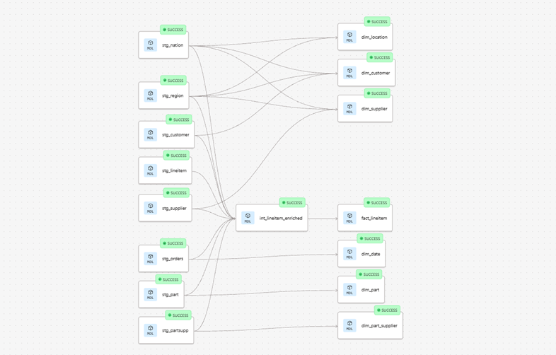

# Analytics — dbt project on TPC-H (Snowflake)

End-to-end analytics engineering project built on top of Snowflake's `TPCH_SF1` sample dataset. It transforms raw OLTP tables (customers, orders, lineitems, suppliers, parts) into a clean, tested, business-ready star schema using **dbt Fusion**.

The goal of the project is to demonstrate a realistic, production-style dbt workflow: layered models, documented sources, generic tests, environment separation (dev / prod), and version control via GitHub.

---

## Overview

This project simulates a production-ready data transformation layer using dbt on Snowflake.

The goal is to transform raw data into clean, well-structured analytical models following best practices in modern data stacks.

---

## Why dbt?

dbt allows transforming data using software engineering best practices:

- Version control
- Testing
- Documentation
- Modular design

This makes data pipelines more robust and production-ready.

---

## Architecture

The project is structured into three main layers:

- **Staging**: Cleans and standardizes raw data sources
- **Intermediate**: Applies business logic and transformations
- **Marts**: Final analytical tables optimized for reporting and analysis

This layered approach ensures modularity, scalability, and maintainability.


---

## Stack

| Layer | Tool |
|---|---|
| Warehouse | Snowflake (`SNOWFLAKE_SAMPLE_DATA.TPCH_SF1`) |
| Transformation | dbt Fusion 2.0 |
| IDE | VS Code + dbt extension |
| Version control | Git / GitHub |
| Orchestration | dbt Cloud (Development + Production environments) |

---

## Source data

Snowflake's open `TPCH_SF1` schema — a TPC benchmark dataset modeling a wholesale supplier:

| Table | Rows |
|---|---|
| CUSTOMER | 150K |
| LINEITEM | 6.0M |
| NATION | 25 |
| ORDERS | 1.5M |
| PART | 200K |
| PARTSUPP | 800K |
| REGION | 5 |
| SUPPLIER | 10K |

Sources are declared in `models/s1_staging/_scr_tpch.yml`.

---

## Project architecture

Three-layer model structure, each with its own materialization strategy defined in `dbt_project.yml`:

```
models/
├── s1_staging/        → materialized as table
├── s2_intermediate/   → materialized as view
└── s3_marts/          → materialized as table
```

### `s1_staging` — clean & rename

One staging model per source table. Light transformations only: column renaming (`l_orderkey` → `order_key`), type casting, no joins, no business logic. This is the only layer that reads from `source()`.

### `s2_intermediate` — enrich & combine

`int_lineitem_enriched` joins lineitems with orders, customers, nations, regions, suppliers, parts and partsupp, then derives the core business metrics (net revenue, discount amount, total cost, profit, price variance, expected revenue) at the line-item grain.

### `s3_marts` — dimensional model

Star schema ready for BI:

- **Fact table:** `fact_lineitem` (grain: one row per order line)
- **Dimensions:** `dim_customer`, `dim_supplier`, `dim_part`, `dim_part_supplier`, `dim_location`, `dim_date`

### Lineage

The DAG below is generated from `dbt build` — every staging model feeds the intermediate layer (or marts directly), and the enriched intermediate feeds the fact table.



---

## Business metrics

Defined once in `int_lineitem_enriched` and inherited by `fact_lineitem`:

| Metric | Formula |
|---|---|
| `gross_revenue` | `line_extended_price` |
| `net_revenue` | `line_extended_price * (1 - line_discount)` |
| `discount_amount` | `line_extended_price * line_discount` |
| `expected_revenue` | `part_retail_price * line_quantity` |
| `price_variance` | `(part_retail_price * line_quantity) - line_extended_price` |
| `total_cost` | `line_quantity * supply_cost` |
| `profit` | `net_revenue - total_cost` |

---

## Tests & documentation

Every model has a corresponding YAML with column descriptions and generic tests. Currently **40 tests** across the project:

- `unique` and `not_null` on every primary key (staging, intermediate, marts)
- `not_null` on every business metric in the intermediate and fact layers
- `relationships` tests on every foreign key in the fact table (→ `dim_customer`, `dim_part`, `dim_supplier`)
- `relationships` tests on the staging FKs (`stg_orders.cust_key`, `stg_lineitem.order_key`, etc.)

Run them with:

```bash
dbt test
```

---

## Project layout

```
project/
├── analyses/                  # ad-hoc SQL (not materialized)
│   ├── customer_value.sql
│   ├── pricing_analysis.sql
│   ├── profitability.sql
│   ├── revenue_trend.sql
│   └── supplier_performance.sql
├── models/
│   ├── s1_staging/
│   │   ├── _scr_tpch.yml      # source declarations
│   │   ├── _stg_tpch.yml      # staging model tests + docs
│   │   ├── _tpch_docs.md      # shared doc blocks
│   │   └── stg_*.sql          # 8 staging models
│   ├── s2_intermediate/
│   │   ├── _int_tpch.yml
│   │   └── int_lineitem_enriched.sql
│   └── s3_marts/
│       ├── _mart_tpch.yml
│       ├── fact_lineitem.sql
│       └── dim_*.sql          # 6 dimensions
├── dbt_project.yml
├── packages.yml
└── profiles.yml
```

---

## Environments

Two environments are configured in dbt Cloud, both running on dbt Fusion:

- **Development (`DEV`)** — used for local development from VS Code, writes to a personal dev schema.
- **Production (`PROD`)** — built from the `main` branch, writes to `analytics_prod`.

The dbt profile is `mi_proyecto_dbt`, defined in `profiles.yml`.

---

## Running the project

Prerequisites: dbt Fusion installed, Snowflake credentials configured in `~/.dbt/profiles.yml`.

```bash
# Install dependencies
dbt deps

# Run all models
dbt run

# Run all tests
dbt test

# Run + test in one shot
dbt build

# Generate & serve docs
dbt docs generate
dbt docs serve
```

Last successful build: **16 models, 40 tests, 0 failures.**

---

## Repository

[github.com/alopezmoreira1989/dbt_project](https://github.com/alopezmoreira1989/dbt_project)

---

## Author

**Alejandro López Moreira** — Analytics Engineer

Built as a portfolio project to practice end-to-end analytics engineering with dbt Fusion and Snowflake.
